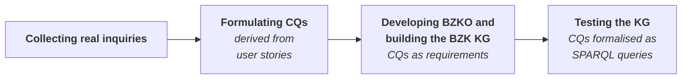

# BZKO Competency Questions
This page presents the competency questions (CQs) of the **BZK Ontology (BZKO)** and the BZK Knowledge Graph (BZK KG). The CQs describe what users of the *Themenportal Wiedergutmachung* [(TP WGM)](https://www.archivportal-d.de/themenportale/wiedergutmachung) and of the BZK KG need to find in the data recorded on the index cards of the Central Federal Card Index (*Bundeszentralkartei*, BZK). They serve both as requirements for the ontology design and as the basis for evaluating the ontology and the knowledge graph.

## How the CQs were developed

The CQs were developed following eXtreme Design (XD) [1], a collaborative, incremental, and iterative method for ontology design, in which the requirements of the ontology are described as small stories by the customer and then transformed into competency questions together with the ontology designers.
In our case, archivists from the Federal Archives of Germany (*Bundesarchiv*) and the State Archives of Baden-Württemberg (*Landesarchiv Baden-Württemberg*) acted as the customer representatives: they created personas, together with their goals and research scenarios, that reflect the actual users of the BZK data. Based on these research scenarios, we formulated user stories and derived the competency questions from them.

In XD, competency questions are not only requirements but also the basis of unit tests. To this end, each competency question will be translated into a SPARQL query and tested against the BZK KG once it has been generated.

## Use cases
The personas are grouped into four use cases. 

| Use case | Users |
|---|---|
| [Private Use](private-use.md) | Family members and descendants of persecuted persons, remembrance initiatives, genealogists|
| [Scientific Use](scientific-use.md) | Researchers in history, genocide and gender studies, provenance research; data scientists | 
| [Historical & Educational Use](historical-educational-use.md) | Schools, museums, local historians, journalists |
| [Official Use](official-use.md) | Federal and state archives, public authorities, lawyers | 

All users access TP WGM, the public online portal that provides semantic search over the BZK cards. Public access is limited at two distinct levels: (1) cards: TP WGM provides access only to cards that are outside the archival restriction period, and (2) data: for these freely accessible cards, the results pages display only a selected subset of the data represented in the BZK KG. Thus, the BZK KG contains data that is not available through TP WGM and is itself not publicly accessible.

Therefore, when an inquiry requires information beyond what TP WGM provides, one of the following cases applies:

1. **Available in the BZK KG.** The required information is represented in the BZK KG but is not accessible through TP WGM because of one of the two access limitations described above. 
2. **Not yet extracted.** The information is recorded on the BZK cards but has not yet been extracted and is therefore not (yet) represented in the BZK KG.
3. **Not contained in the BZK cards.** The BZK cards themselves do not contain the information required to answer the inquiry. For example, a widow may have applied for compensation on behalf of her husband, but the card does not represent their familial relationship and the husband's death.
4. **Available elsewhere in the WGM collection.** The BZK cards alone cannot answer the inquiry, but other documents in the *Wiedergutmachung* collection may provide the required information, such as a marriage certificate that establishes a marital relationship.

Cases 3–4 are what we refer to as **knowledge gaps**.

## CQ categories
Each competency question falls into one of three categories, depending on the information it addresses and whether it can be answered through the public portal TP WGM or requires access to the non-public BZK KG.

| # | Category | What it covers | Example |
|---|---|---|---|
| 1 | Queries answerable through TP WGM | Searches that a user can perform on the portal, such as finding BZK cards associated with a person by name, date of birth, birthplace, or address. | *Which BZK cards are associated with a person whose birth name is X, date of birth is Y, and birthplace is Z?* ([P01-CQ1](all-cqs.md)) |
| 2 | Queries over the complete BZK KG | Queries that require access to data in the BZK KG beyond what is exposed through TP WGM, such as counts, information regarding the compensation offices and their holding archives, or layout patterns across cards. | *How many BZK cards are associated with two distinct people, one with an applicant role and the other with a persecutee role?* ([P16-CQ2](all-cqs.md)) |
| 3 | Data provenance and processing queries | Queries about how a value was extracted, normalized, validated, or resolved, including its processing status, the method or model used, and confidence information. These are answered through queries over the BZK KG. | *Which extraction model produced a value X?* ([P13-CQ1](all-cqs.md)) |

## Personas

| ID | Persona | Asks | Use case |
|---|---|---|---|
| P01 | [Angela](private-use.md#angela-did-my-grandmother-apply-for-compensation) Family member of a persecuted person | "Did my grandmother apply for compensation?" | Private Use |
| P02 | [John](private-use.md#john-who-are-the-heirs-my-relatives-in-europe) Distant relative of a persecuted person | "Who are the heirs, my relatives in Europe?" | Private Use |
| P03 | [Stolperstein-Initiative Rheinhausen](private-use.md#stolperstein-initiative-rheinhausen-who-lived-in-rheinhausen-and-where-are-their-records) Local remembrance initiative | "Who lived in Rheinhausen, and where are their records?" | Private Use |
| P04 | [Markus](private-use.md#markus-is-there-evidence-of-my-grandfathers-german-citizenship) Descendant of a person who emigrated to the USA in 1937 due to persecution and became an American citizen | "Is there evidence of my grandfather's German citizenship?" | Private Use |
| P05 | [David](scientific-use.md#david-who-emigrated-to-argentina-and-applied-for-compensation) Doctoral researcher of Genocide Studies | "Who emigrated to Argentina and applied for compensation?" | Scientific Use |
| P06 | [Lisa](scientific-use.md#lisa-which-widows-applied-on-behalf-of-their-persecuted-husbands) Master student in Gender Studies | "Which widows applied on behalf of their persecuted husbands?" | Scientific Use |
| P07 | [Jürgen](scientific-use.md#jürgen-how-did-the-munich-and-bremen-offices-handle-applications) Postdoctoral researcher in Modern History | "How did the Munich and Bremen offices handle applications?" | Scientific Use |
| P08 | [Maria](scientific-use.md#maria-is-there-a-compensation-record-for-this-education-reformer) Professor of Educational Science | "Is there a compensation record for this education reformer?" | Scientific Use |
| P09 | [Kim](scientific-use.md#kim-did-younger-applicants-more-often-live-overseas) Doctoral researcher in Quantitative History | "Did younger applicants more often live overseas?" | Scientific Use |
| P10 | [Hans](scientific-use.md#hans-did-the-art-collector-file-a-compensation-claim) Art-provenance researcher | "Did the art collector file a compensation claim?" | Scientific Use |
| P11 | [Rainer](scientific-use.md#jürgen-what-do-the-records-reveal-about-this-familys-art-collection) Art-provenance researcher | "What do the records reveal about this family's art collection?" | Scientific Use |
| P12 | [Laura](scientific-use.md#laura-how-complete-and-reliable-is-the-bzk-data) Data scientist | "How complete and reliable is the BZK data?" | Scientific Use |
| P13 | [Anja](scientific-use.md#anja-how-did-each-data-point-come-to-be) Data scientist | "How did each data point come to be?" | Scientific Use |
| P14 | [Ludger](historical-educational-use.md#ludger-how-did-national-socialism-affect-schwielowelbe) Member of a local history association of Schwielow/Elbe | "How did National Socialism affect Schwielow/Elbe?" | Historical & Educational Use |
| P15 | [Mrs. Schmidt](historical-educational-use.md#mrs-schmidt-which-local-residents-were-persecuted) History teacher at the school Bettina-von-Suttner of the city of Gunsdorf | "Which local residents were persecuted?" | Historical & Educational Use |
| P16 | [Mr. H. Storian](historical-educational-use.md#mr-h-storian-who-applied-for-whom-and-through-which-office) Historian of post-war Germany's relationship with its past | "Who applied for whom, and through which office?" | Historical & Educational Use |
| P17 | [Claudia](historical-educational-use.md#claudia-which-bavarian-cases-can-we-show-in-the-exhibition) Museum curator at the Bavarian State Museum | "Which Bavarian cases can we show in the exhibition?" | Historical & Educational Use |
| P18 | [Torsten](historical-educational-use.md#john-which-nazi-victims-are-connected-to-my-town) Local journalist of the newspaper Rhein-Zeitung | "Which Nazi victims are connected to my town?" | Historical & Educational Use |
| P19 | [Petra](historical-educational-use.md#petra-was-a-claim-ever-filed-for-this-athlete) Investigative journalist working for a renowned magazine | "Was a claim ever filed for this athlete?" | Historical & Educational Use |
| P20 | [Kevin](official-use.md#kevin-which-cards-may-need-to-be-removed-from-the-online-collection) Employee at the federal Archives | "Which cards may need to be removed from the online collection?" | Official Use |
| P21 | [Sabine](official-use.md#sabine-do-our-archives-files-match-the-bzk-cards) Archivist at State Archives of Baden-Württemberg  | "Do our archive's files match the BZK cards?" | Official Use |
| P22 | [Mrs. C.L. Erk](official-use.md#mrs-cl-erk-does-a-file-already-exist-and-where-is-it-kept) Employee at the compensation office in Düsseldorf | "Does a file already exist, and where is it kept?" | Official Use |
| P23 | [Mr. Grünberg](official-use.md#mr-grünberg-did-this-applicant-receive-benefits-before) Government official handling a hardship-relief application | "Did this applicant receive benefits before?" | Official Use |
| P24 | [Daniel](official-use.md#daniel-can-my-client-claim-german-citizenship) Lawyer | "Can my client claim German citizenship?" | Official Use |

## All CQs and machine-readable catalog

- [All CQs in one table](all-cqs.md), with their categories
- [`cq_catalog.csv`](cq_catalog.csv): one row per CQ, for scripts and the later SPARQL evaluation

## References

[1] V. Presutti, E. Daga, A. Gangemi, E. Blomqvist. eXtreme Design with Content Ontology Design Patterns. In: *Proceedings of the Workshop on Ontology Patterns (WOP 2009)*, CEUR Workshop Proceedings, Vol. 516, 2009. <https://ceur-ws.org/Vol-516/pap21.pdf>
